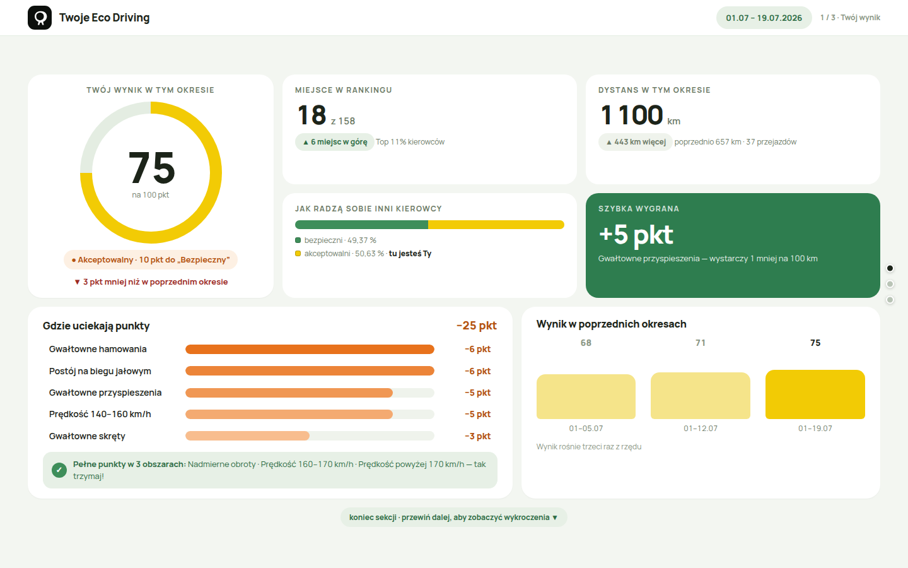
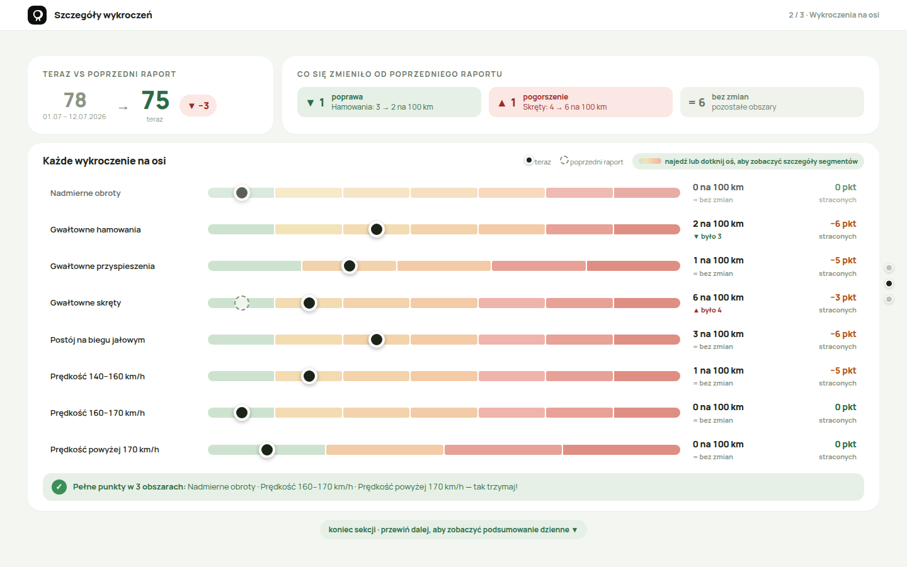
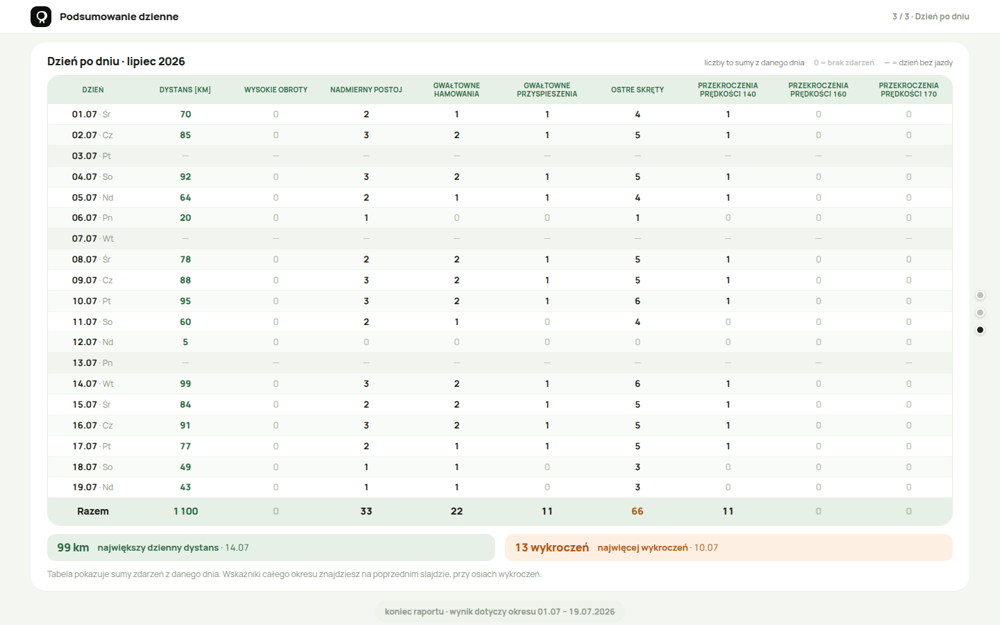
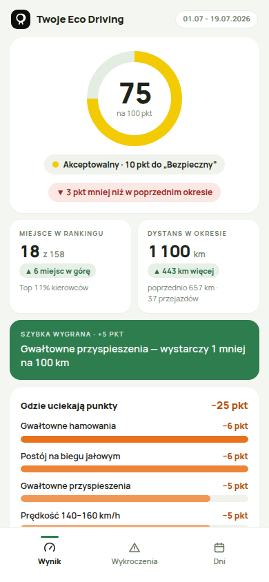
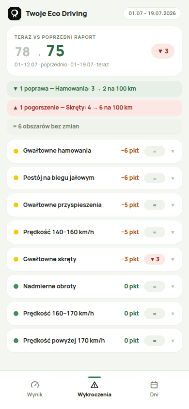
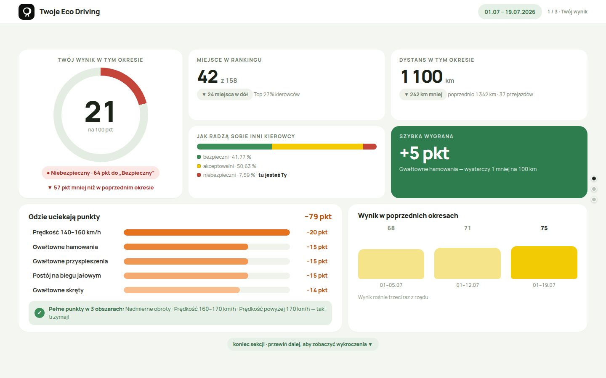
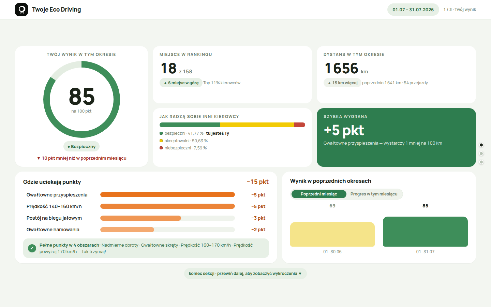
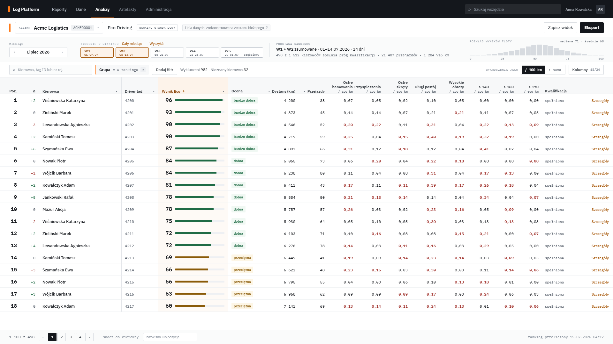
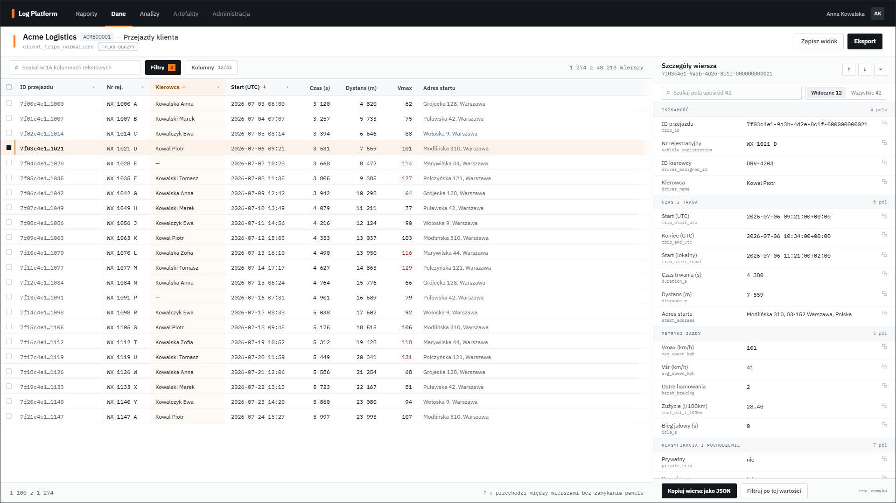
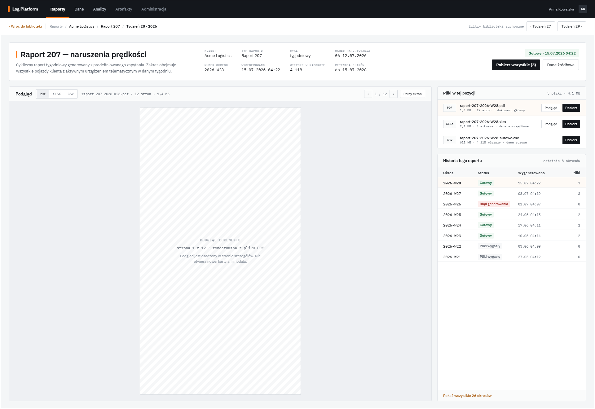

**English** · [Polski](README.pl.md)

# Log Platform

An automation platform for companies that run vehicle fleets. Every day it pulls telematics data (trips, fuel use, speeding, harsh manoeuvres) from a telematics provider's API, keeps it in the client's own database, computes an Eco Driving ranking for drivers and sends them weekly and monthly summaries with a personal, access-protected dashboard. Operators get a portal with reports, a data explorer and an artifact registry.

The system has been in production since 2026 in a "one host, many clients" model. This repository is an **anonymised snapshot** of the production code; see [About this repository](#about-this-repository) at the bottom.

## What the system does

For a reader who does not read code:

- **Pulls telematics data without a human in the loop.** A scheduler (dispatcher) queries the provider's API every few hours for each client's new trips and events, and the result lands in that client's own database. Ingestion is resilient to provider-side delays: trips that "arrive late" are picked up by reconciliation windows (daily, weekly, 32-day).
- **Runs the Eco Driving programme.** Trips and events become a 0 to 100 score per driver, a ranking within the fleet, qualification thresholds (minimum distance), a comparison with the previous period and a breakdown of lost points by category.
- **Sends drivers e-mails and a dashboard.** Every week and every month a driver receives a message matched to their score, with a link to a personal dashboard. The link is a one-off "key" (capability link): no account, no password, and the server never sees the secret in the address.
- **Gives operators a portal.** A library of recurring reports, a client data explorer (filters, value distributions, background exports, saved views), the Eco Driving ranking with drill-down to a single trip, and an artifact registry with integrity verification.
- **Watches itself.** Every job run has a record of runs, structured logs and artifacts. Retention removes old data according to per-client policies. Errors and violated invariants land in a "suspected bugs" register with e-mail notification. Production operations (environment promotion, restore from backup) have fail-closed contracts: they refuse to act when the environment identity does not match.

## Screenshots

All data in the screenshots is synthetic.

**Driver dashboard** (desktop, 1440 px; rendered from the fixtures in this repository):

| Score | Violations | Days |
|---|---|---|
|  |  |  |

**Driver dashboard** (mobile, 390 px) and state variants:

| Mobile: Score | Mobile: Violations | "Dangerous" driver | Monthly period |
|---|---|---|---|
|  |  |  |  |

**Operator portal** (approved screen designs the portal was built from; directory `design-handoffs/log-platform`):

| Eco Driving ranking | Data explorer | Report library |
|---|---|---|
|  |  |  |

The remaining screens (dataset catalogue, background exports, dark mode, tablet, artifacts) are in `design-handoffs/log-platform/approved/v1.0/log-platform-approved-design-handoff/reference/screens/`. The product UI is in Polish, as are its users.

## How it works

```
 telematics provider API ──► jobs/api/telematics/*  ──► client business database (Postgres, one per client)
                                   │                             │
                                   │ runs / logs / artifacts      │ trips, events, fuel
                                   ▼                             ▼
                          api/main.py (FastAPI)          jobs/ecodriving/* ──► ranking, e-mails
                          Postgres + MinIO                       │
                                   │                             ▼
                                   ▼                    jobs/ecodriving_dashboard/* ──► driver snapshot
                          operator portal (HTML/JS)              │
                                                                 ▼
                                               delivery/ (Cloudflare Worker + D1 + R2) ──► driver dashboard
```

Three layers:

1. **Platform core**: a shared model of runs, structured logs, binary artifacts and retention. Every job, whatever its kind, reports to the same API. The host scheduler is systemd (timers and units in `ops/systemd`).
2. **Workflow A, telematics API integration**: dispatcher, trip and event sync with time-coverage control, reconciliation of late data, daily aggregates, per-client retention, onboarding of a new client from a script and a YAML file. The Eco Driving programme (aggregation, weekly and monthly e-mails, dashboard snapshot, secure publication).
3. **Workflow B, e-mail report pipeline** (fallback path, development paused): fetching reports from IMAP, CSV and XLSX normalisation, report type detection and validation, feeding the client database from reports.

The operator portal and the driver dashboard are written without a frontend framework: server-rendered HTML plus JS modules with no bundler. The driver dashboard is a single static package whose five presentation files are byte-identical to the approved design (a test in the repository guards their SHA-256 digests).

## Stack

| Area | Technology |
|---|---|
| Backend | Python 3.12, FastAPI, psycopg 3 |
| Data | PostgreSQL 16 (platform database plus one database per client), MinIO / S3 for artifacts |
| Runtime | Docker Compose (API), systemd (jobs, timers, watchdog), one Linux host |
| Frontend | HTML, CSS, JavaScript with no framework; design tokens, light and dark theme, WCAG 2.1 AA |
| Dashboard delivery | Cloudflare Workers, D1 (grants), R2 (snapshots), capability links, `__Host-` cookie |
| Tests | 275 test files (Python and Node), including tests on disposable Postgres instances and browser tests through WebDriver |

## Scale

| Measure | Value |
|---|---|
| HTTP endpoints in the API | 132 |
| Platform database migrations | 71 |
| Client database migrations | 45 |
| API code | about 62k lines |
| Job code | about 67k lines |
| Tests | about 210k lines |
| Design documentation | 45 documents in `docs/`, 3 design handoff packages |

## Running it

### Driver dashboard, with nothing to install

Only Python 3 is needed (any static file server works too):

```bash
cd assets/driver_eco_dashboard
python3 -m http.server 8731 --bind 127.0.0.1
```

Then open `http://127.0.0.1:8731/preview.html`. The drop-down switches between 16 synthetic states (safe driver, dangerous driver, newly ranked, not enough distance, report not ready, and others). The address `preview.html?fixture=<name>#weekly/2` opens a given state on a given slide.

### The whole stack: API, Postgres, MinIO, portal

The script in `demo/` brings up an isolated stack on ports that do not collide with a production instance, applies the migrations, onboards two synthetic clients and creates an administrator account. Details and limits: [demo/README.md](demo/README.md).

```bash
./demo/up.sh
```

## Where to start reading

For a developer, or an AI assistant asked to assess this code:

1. [ARCHITECTURE.md](ARCHITECTURE.md): system map, data flow, design decisions.
2. [CONVENTIONS.md](CONVENTIONS.md): naming, error handling, migration discipline.
3. [docs/00_overview.md](docs/00_overview.md) and [docs/05_jobs.md](docs/05_jobs.md): the job catalogue with contracts.
4. [docs/22_portal_ui_foundation_and_shared_shell.md](docs/22_portal_ui_foundation_and_shared_shell.md): why the portal has no framework and how it is built.
5. [docs/28_driver_eco_dashboard_v1_snapshot_foundation.md](docs/28_driver_eco_dashboard_v1_snapshot_foundation.md) and [delivery/driver_eco_dashboard/README.md](delivery/driver_eco_dashboard/README.md): the driver snapshot contract and secure publication.
6. [docs/06_security.md](docs/06_security.md), [docs/08_retention.md](docs/08_retention.md), [docs/09_disaster_recovery.md](docs/09_disaster_recovery.md): security, retention, recovery.
7. Tests: `ops/tests_manual/test_*.py` and `ops/tests_manual/*_harness.mjs`. Most integration tests start their own disposable Postgres (`ops/tests_manual/disposable_postgres.py`).

The documents in `docs/` numbered 12 and up record design decisions in the order they were made, audits and repair plans included. They are the engineering history of the system, not a manual. The engineering documentation is written in a mix of Polish and English, as it was for the team that built the system; code, identifiers and commit-level comments are in English.

## About this repository

This is a snapshot of a private production repository, generated automatically by an export script and checked against a list of forbidden tokens before publication.

- **Clients and the provider are anonymised.** Client codes are pseudonyms (`ALPHA00001`, `BRAVO00016`, `DELTA00001` and the like), the telematics provider appears as `telematics`, e-mail addresses and hosts point at `example.invalid` domains. The renaming is consistent across code, SQL, tests and documentation, so the project still compiles and the tests pass.
- **No production data is included.** Registration plates in tests and documents are deterministically faked, environment identifiers are hashed, and the dashboard and prototype fixtures were synthetic from the start.
- **Commit history is not carried over.** Every publication is a single "Snapshot" commit.
- **Deliberately absent**: operational incident reports, real sample reports from the provider, the provider's OpenAPI specification (documents in `docs/` may refer to it), and the context files for AI assistants used during development.

Author: Paweł Dzierzek. Source made available for review as a work sample.
